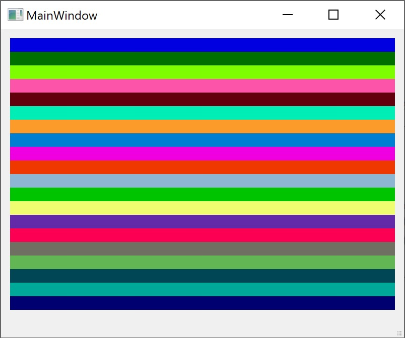

# DistinctColor
an algorithm to generate several visual distinct color, C++ Code  
original from matlab: https://www.mathworks.com/matlabcentral/fileexchange/29702-generate-maximally-perceptually-distinct-colors

